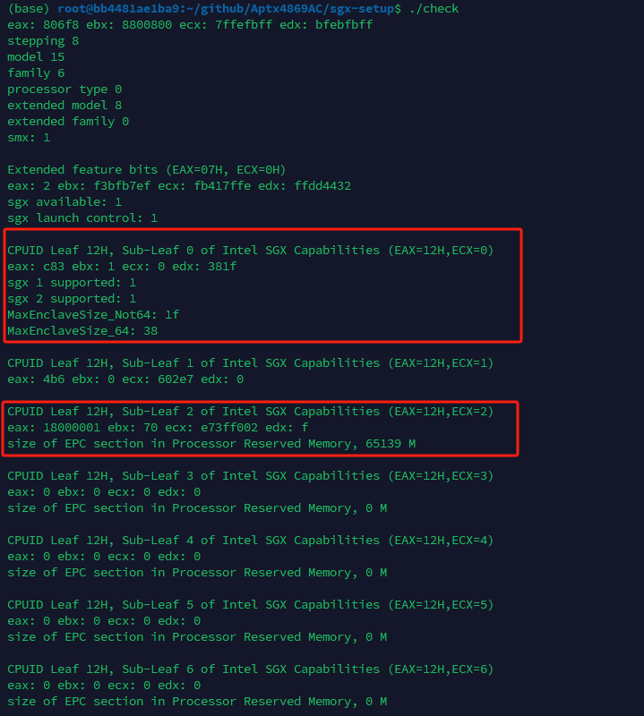
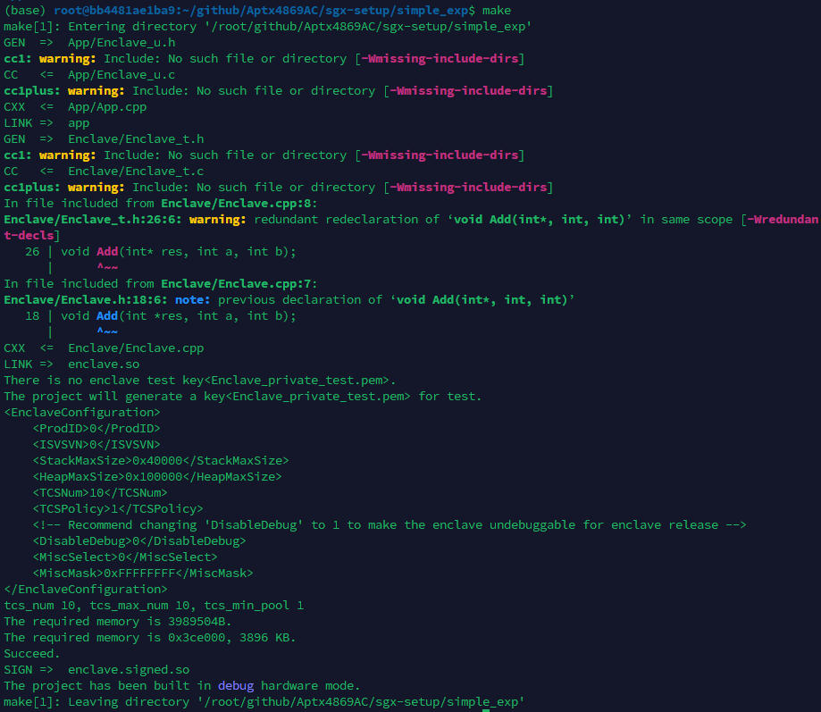
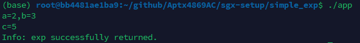

# Install Intel SGX

Intel(R) Software Guard Extensions (SGX) is an Intel technology for application developers seeking to protect secret code and data from disclosure or modification. Refer to https://github.com/intel/linux-sgx for more details.


**Prerequisites**

1. Check whether your machine support Intel SGX (you can also run the attached project: `check_sgx.c`);

   ```shell
   gcc -o check check_sgx.c
   ./check
   ```

   

   PS: As shown in the figure, sgx 1 supported: 1 indicates support, while 0 indicates lack of support.

2. OS: Ubuntu 20.04 LTS, Ubuntu 22.04 LTS, or Ubuntu 24.04 LTS;

**Installation**

1. find `install_deps.sh` and `install_sgx_driver.sh` (you may need to modify the `SGX_SDK_VERSION` in the file.);
2. install the dependencies and Intel SGX SDK;

```bash
sudo ./install_deps.sh
```

PS: The command `source /opt/intel/sgxsdk/environment` represents the SGX source path. To automate its execution every time the terminal starts, consider adding this command to the ~/.bashrc file.

3. install the Intel SGX Driver

```bash
sudo ./install_sgx_driver.sh
```

4. startup the Intel SGX services

```bash
sudo /opt/intel/sgx-aesm-service/startup.sh	
```

If any issues arise during the installation process, you can refer to https://github.com/intel/linux-sgx for guidance.

5. test the installation

+ compile the code (refer to the attached project: `simple_exp`)

```bash
make  # hardware mode
make SGX_MODE=SIM  # simulation mode
```



+ run the binary

```bash
./app
```

 